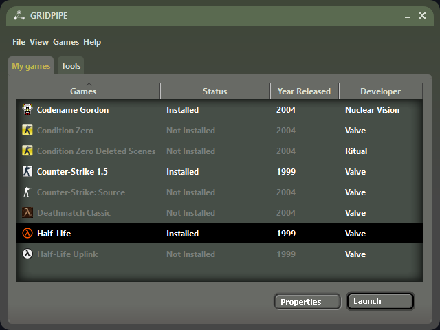

# Gridpipe

An attempt to recreate the nostalgic Steam launcher from 2005, implemented using PySide6 (Qt for Python). This project replicates the classic UI and functionality of the original Steam client while allowing users to fetch and install games directly from the Internet Archive.

---

## Features  
- **Classic Steam 2005 Interface (not finished)**  
  Faithfully recreated using PySide6 with retro design and functionality in mind.  
- **Game Installation from the Internet Archive**  
  Browse and install games hosted on the Internet Archive with ease.  
- **Game Library Management**  
  A customizable game library managed through a simple JSON file that tracks installation status, download sources, and executable paths.  

---

## Usage  

- **Game Installation:**  
  Select a game from the list. The launcher will fetch the files from the Internet Archive and mark the game as installed once complete.  

- **Game Launching:**  
  After installation, click on the game to launch it using the configured executable path.  

- **Game Management:**  
  Modify `games.json` to add or remove games from the launcher.  

---

## Roadmap  

Future improvements and features:  
- **Multi-Game Downloading**  
  Allow users to download and install multiple games simultaneously for a more efficient experience.  
- **In-App Game Management**  
  Provide a graphical interface for managing the game library (add/remove games, configure settings). 
- **Game Backup and Restore**  
  Allow users to back up their installed games and restore them easily on a different machine.
- **Game Modding Support**  
  Integrate a system for downloading and managing mods for supported games.  

## Acknowledgments  

- **Internet Archive** for providing the resources to make retro gaming possible.  
- The PySide6 community for powerful Qt bindings.  
- Valve for the original Steam client design that inspired this project.  
